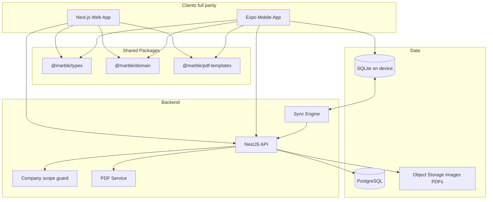
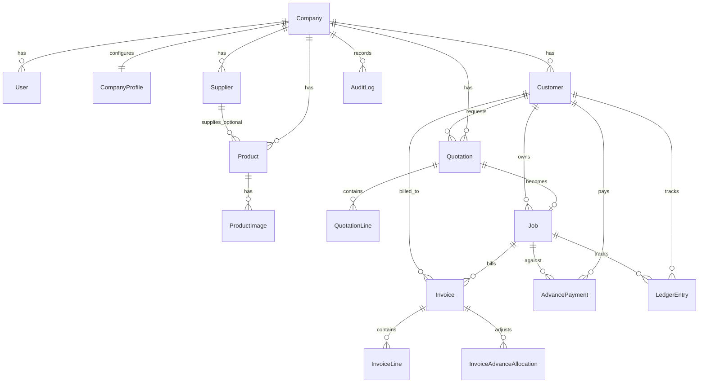
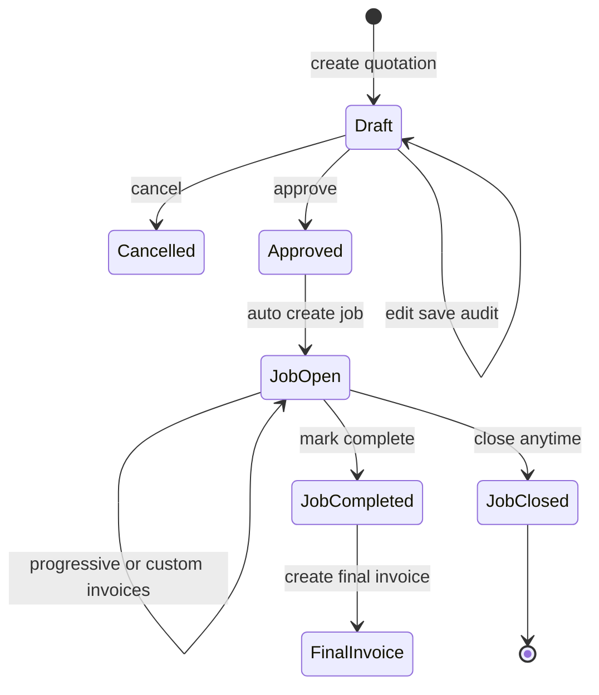
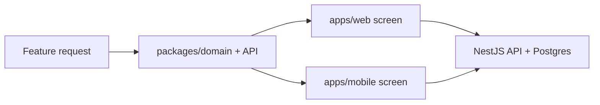

# Marble with Nuage — Development Plan

## Product summary

**Marble with Nuage** is a multi-company SaaS for marble/stone businesses. Each company manages suppliers, products, customers, quotations, jobs, invoices, advances, and printable PDFs. **Web and mobile have full feature parity**; mobile also works offline and syncs when online.

**Pilot company:** Binhaj Marble (first real tenant for experiments).

**Decisions locked:**
- Stack: Next.js (web) + Expo/React Native (mobile) + NestJS API + PostgreSQL
- Invoicing: UAE tax invoice PDFs (TRN, 5% VAT, advance adjustment, credit notes) — not FTA e-invoicing yet
- **V1 access:** no roles — every user of a company can do everything
- **V1 auth UX deferred:** polished signup, login, and user management come later; V1 uses bootstrap/seeded company access for development and pilot
- Suppliers are first-class; products may optionally tag a supplier
- Invoicing and money tracking are reachable from **customer**, **job**, and **invoice** entry points

---

## Architecture



### Monorepo layout (pnpm + Turborepo)

```
marble-with-nuage/
  apps/
    api/          # NestJS
    web/          # Next.js App Router
    mobile/       # Expo
  packages/
    types/        # DTOs, enums, Zod schemas
    domain/       # Pure calculation: VAT, advances, ledgers, P&L
    pdf/          # Shared PDF templates
    eslint-config/
    tsconfig/
```

### Why this split
- Quotation-level purchase/sell overrides, advance allocation, and customer/job ledger math live in `packages/domain` so web, mobile, and API never diverge.
- PDF templates are shared so printed docs match on both clients.
- Company isolation is enforced in the API (never trust the client).

---

## Access model (V1 vs later)

### V1 (build and pilot)
- No role matrix. Anyone operating inside a company can use all features.
- **Signup, login UI, and user management are out of V1 scope.**
- Bootstrap: seed **Binhaj Marble** company + a simple company-scoped session (dev token / env switch) so work can proceed on real screens without building auth product yet.
- Schema still has `Company` and a lightweight `User` (or `Actor`) for audit (`createdBy` / `updatedBy`), ready for later auth.

### Later (post-V1)
- Signup / login / user management.
- Users identified by email, each belonging to a company.
- Still **no roles** unless you ask later — every email in a company has full access.

---

## Navigation and screen model

Every major area has its **own dashboard** (list + filters + actions), on **both web and mobile**:

- Home / overview
- **Customers** (hub — see below)
- **Suppliers**
- **Products**
- **Quotations** dashboard
- **Jobs** dashboard
- **Invoices** dashboard
- **Advances / receipts** (or nested under Accounts)
- **Accounts** (company-level AR / advances / P&L summaries)
- Company profile (logo, name, signature, TRN, prefixes)
- Audit history

### Customer hub (critical UX)

Opening a customer shows a **financial and document cockpit**:

- **Receivable summary:** total billed, total paid/advanced, **balance due** (how much to get from this customer)
- **Advances:** total advances taken, unallocated advance remaining
- **Breakdown by quotation and job:** which quotation/job the receivable and advances belong to
- Tabs or sections: Quotations | Jobs | Invoices | Advances / payments | Ledger
- Actions from customer: **create quotation**, **record advance**, **create invoice** (progressive/custom/final against an open job of this customer)

### Job hub

Opening a job shows:

- Linked quotation, customer
- Job value, invoiced to date, advances applied, **balance remaining**
- Invoices list, advances list, **job ledger**
- Actions: progressive/custom/final invoice, record advance, complete, close
- P&L using quotation line purchase vs sell (not live product prices)

### Invoice creation entry points (all supported)

1. Invoices dashboard → new invoice
2. Job detail → new invoice
3. Customer detail → new invoice (pick job / link to quotation context)

Same domain rules everywhere; only the starting context differs.

---

## Core domain model



### Key entities

- **CompanyProfile** — legal/trade name, logo, signature, address, TRN, phone, email, bank details, document number prefixes
- **Supplier** — name, contact, phone, email, address, notes; openable detail screen; optional link from products
- **Product** — name, SKU, unit, default purchase/sell price, optional `supplierId`, active flag
- **ProductImage** — multiple images; exactly one `isDefault=true` for PDFs
- **Customer** — name, phone, email, address, TRN (optional), notes; hub for documents + money
- **Quotation** — `draft` → `approved` | `cancelled`
- **QuotationLine** — product ref + **line purchasePrice** + **line sellPrice** (editable; P&L uses these)
- **Job** — created on quotation approve; `open` → `completed` | `closed` (close anytime)
- **AdvancePayment** — against customer + usually a job; unallocated balance tracked
- **Invoice** — `final` | `progressive` | `custom`; always tied to customer; normally to a job
- **InvoiceAdvanceAllocation** — advance adjusted on this invoice
- **LedgerEntry** — normalized financial trail (invoice issued, payment/advance received, advance allocated, credit note, adjustment) for **customer** and **job** views
- **AuditLog** — entity type/id, action, before/after JSON, actor, timestamp on every create/update/status change

### Accounts detail (V1)

Accounts are more than invoice totals:

- **Customer ledger:** chronological transactions; running balance; filters by job/quotation
- **Job ledger:** same events scoped to one job
- **Company accounts dashboard:** total AR, total unallocated advances, overdue-ish open balances (simple date-based), P&L by job/quotation
- All money documents printable (quotation, invoice, credit note, advance receipt)

### Money and P&L rule (critical)

- Product catalog stores *default* purchase/sell prices (and optional supplier).
- Quotation lines store *actual* purchase/sell for that deal.
- Profit/loss and job costing use **quotation/invoice line prices**, never live catalog prices.

---

## Business workflows

### Quotation → Job → Invoice



1. Create quotation (from Quotations dashboard or Customer hub); adjust line purchase/sell; save (audited).
2. Print quotation PDF (logo, name, signature, default product images).
3. Approve → Job created; Cancel → no job.
4. Record advances (from Customer or Job); remaining unallocated balance available later.
5. Progressive / custom invoices from Customer, Job, or Invoices dashboard; allocate advances; VAT 5%.
6. Complete job → optional final invoice for remainder.
7. Close job anytime → V1: no new invoices on closed jobs.

### UAE tax invoice PDF (v1)

Seller name/address/TRN, buyer name/address/TRN if any, invoice number/date, lines, qty, unit price, taxable amount, VAT 5%, VAT amount, total, advance adjusted, net payable, payment terms, logo + signature. Credit notes in the invoicing phase.

---

## Offline mobile sync

- Local store: SQLite (Expo SQLite / WatermelonDB), same logical tables, scoped by `companyId`.
- Sync: push/pull with `updatedAt` + `version` + UUID PKs created on device.
- Conflicts (v1): last-write-wins on drafts; **server wins** if approved / invoiced / cancelled.
- Images: local URI offline → upload queue → object storage on reconnect.
- Endpoints: `POST /sync/push`, `GET /sync/pull?since=`.
- Web online-only in V1; **feature set still fully available on web**.

---

## Feature parity map (web = mobile)

| Module | Web | Mobile | Offline on mobile |
|--------|-----|--------|-------------------|
| Module dashboards (Customers, Suppliers, Products, Quotations, Jobs, Invoices, Accounts) | Full | Full | Yes |
| Company profile (logo, name, signature, TRN) | Full | Full | Yes |
| Suppliers CRUD + detail | Full | Full | Yes |
| Products + optional supplier + multi images + default | Full | Full | Yes |
| Customer hub (docs + receivable + advances by quotation/job + ledger) | Full | Full | Yes |
| Quotations CRUD + approve/cancel + PDF | Full | Full | Yes |
| Jobs + complete/close + job ledger + P&L | Full | Full | Yes |
| Invoice from customer / job / invoices screens | Full | Full | Yes |
| Advances + allocation on progressive invoices | Full | Full | Yes |
| UAE tax invoice / credit note / receipts PDF | Full | Full | Generate from local data |
| Audit history | Full | Full | Pull |
| Polished signup / login / user management | Later | Later | — |

---

## Side-by-side development (web + mobile)

We do **not** build web first then mobile later. Each feature lands in this order:

1. **Domain + API** in NestJS + `packages/domain` / `packages/types` (one source of truth for prices, VAT, advances, ledgers)
2. **Web screen** against that API (fastest to click-test in Chrome)
3. **Mobile screen** against the **same API** (and later the same offline sync layer)
4. Shared PDF/templates from `packages/pdf` so printouts match

Same company data, same endpoints, same Zod contracts. If web can create a quotation, mobile calls the identical `POST /quotations`. UI layout differs; business rules do not.



Day-to-day while coding: one terminal runs API + Postgres; another runs Next.js; another runs Expo. Change a calculation once in `packages/domain` — both clients pick it up.

---

## How you test both sides on your Mac

### What you need installed
- Node.js 22+ and pnpm
- Docker Desktop (for local PostgreSQL)
- Xcode (for iOS Simulator) — from Mac App Store
- Optional: Android Studio only if you also want an Android emulator

### One-time / daily start (after Phase 0 exists)
From the repo root, roughly:

```bash
pnpm install
docker compose up -d          # Postgres
pnpm --filter api prisma migrate dev
pnpm --filter api seed        # Binhaj Marble
pnpm dev                      # turbo: api + web + mobile together
```

Or three terminals if you prefer:
- `pnpm --filter api dev` → API at `http://localhost:3001`
- `pnpm --filter web dev` → Web at `http://localhost:3000`
- `pnpm --filter mobile start` → Expo Dev Tools

### Where you open each client
- **Web:** Chrome/Safari → `http://localhost:3000`
- **Mobile (easiest on Mac):** iOS Simulator — in Expo press `i`, or run `pnpm --filter mobile ios`
- **Mobile on your iPhone (same Wi‑Fi):** install **Expo Go**, scan the QR from the Expo terminal (API URL must use your Mac’s LAN IP, e.g. `http://192.168.x.x:3001`, not only `localhost`)

### Cross-check parity (typical test loop)
1. On **web**, create a customer / quotation
2. On **mobile**, pull/refresh (or wait for sync later) and confirm the same record
3. Edit on mobile → confirm on web
4. Print PDF on both → same numbers and branding

Bootstrap V1 access means both apps use the seeded **Binhaj Marble** company session — no signup UI required to test.

---

## Tech choices (concrete)

- **API:** NestJS + Prisma + PostgreSQL
- **Access (V1):** company-scoped API key / bootstrap JWT for seeded tenants; replace with real auth later
- **Files:** Cloudflare R2 or S3-compatible (local MinIO or disk stub acceptable in early Phase 0–1)
- **PDF:** `@react-pdf/renderer` in shared package; server render for download
- **Web:** Next.js App Router, Tailwind, shadcn/ui
- **Mobile:** Expo Router; UI tokens aligned with web
- **Validation:** Zod in `packages/types`
- **Audit:** Nest interceptor / Prisma middleware → `AuditLog`
- **Deploy:** API + web on Railway/Fly/Render; managed Postgres; mobile EAS Build
- **Repo:** current workspace → https://github.com/usman13581/Marble_with_Nuage.git
- **Local Mac:** Docker Postgres + Next.js browser + Expo iOS Simulator (primary); Expo Go on physical iPhone optional

---

## Phased delivery

### Phase 0 — Foundation
- Monorepo, CI, env templates
- Prisma: Company, CompanyProfile, lightweight User/Actor, AuditLog
- Company scope on all APIs; bootstrap access (no signup UI)
- Seed Binhaj Marble
- Web + Expo app shells with navigation to all module dashboards

### Phase 1 — Catalog and CRM
- Suppliers CRUD + detail
- Products CRUD, optional supplier tag, multi-image + default
- Customers list + customer hub shell (tabs ready)
- Company profile: logo, name, signature, TRN, prefixes
- Audit on all writes

### Phase 2 — Quotations, Jobs, dashboards
- Quotations / Jobs / Invoices / Customers / Suppliers dashboards (parity web + mobile)
- Quotation lines with adjustable purchase/sell; PDF
- Approve → Job; Cancel
- Job complete/close; quotation/job P&L

### Phase 3 — Accounts and invoicing
- LedgerEntry model; customer ledger + job ledger
- Customer hub financial summary (due, advances, by quotation/job)
- Advances; invoice from customer / job / invoices screens
- Progressive / custom / final invoices with advance allocation
- UAE tax invoice PDF + credit note + advance receipts
- Company Accounts dashboard (AR, advances, P&L)

### Phase 4 — Offline and parity hardening
- Ensure every V1 feature works on mobile the same as web
- SQLite + sync push/pull, conflicts, image queue

### Phase 5 — Binhaj Marble pilot
- Sample/import suppliers, products, customers
- Run real quotation → job → advance → progressive invoice flows
- Fix gaps from pilot usage

### Later — Auth product
- Signup, login, user management
- Email belongs to a company; all company users full access (no roles)

---

## Non-goals for V1

- Roles / permissions matrix
- Polished signup, login, invite, user admin UI
- Full FTA e-invoicing / Peppol
- Inventory stock / warehouse
- Accounting package export (CSV later if needed)
- Multi-currency (AED only)
- Web offline

---

## Success criteria

- From a **customer screen**, see balance due, advances, and linkage to quotations/jobs; create invoice and advance from there.
- From a **job screen**, see the same money story and create invoices/advances.
- Suppliers exist; products can optionally tag a supplier.
- Separate dashboards for quotations, invoices, jobs, customers, suppliers, accounts — on **web and mobile**.
- Quotation line prices drive P&L; audit on every save; UAE VAT PDFs with advance adjustment.
- Binhaj Marble can run a real job end-to-end on staging without needing the later auth product.
