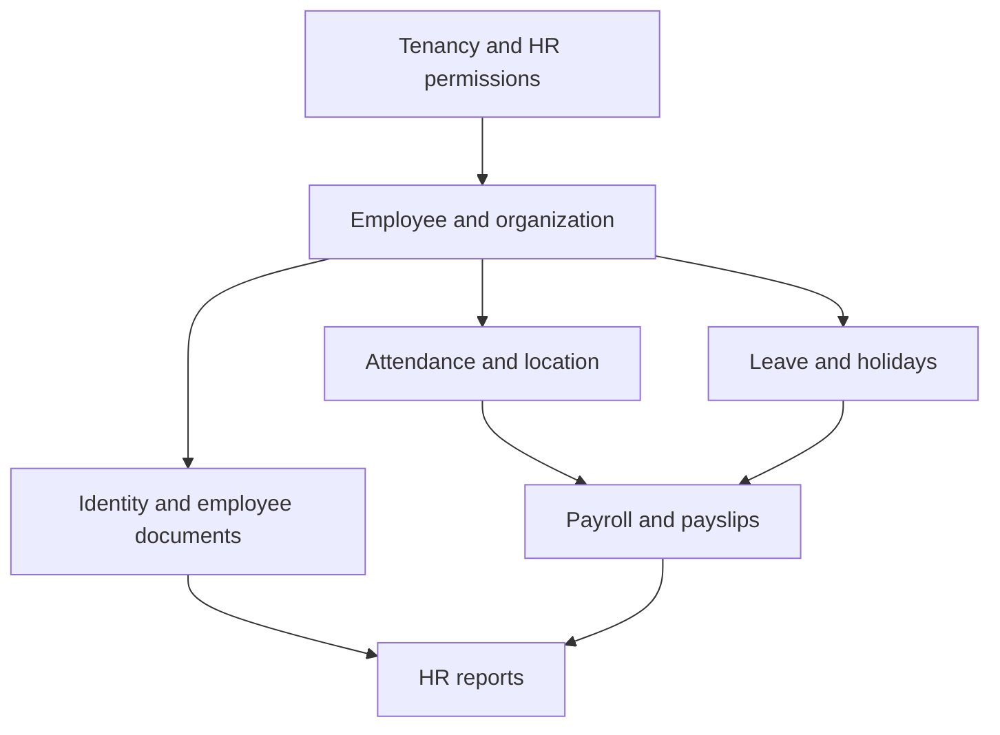

# HR module plan

HR should be a company-scoped module available on web and mobile. The first release should cover employee records, attendance, leave, and **full payroll calculation/payslips**. It should not depend on Stripe or a government payroll integration.

## Decisions

- Employee is a separate `Employee` record, optionally linked to the existing company `User`.
- Any linked employee may check in from web or mobile.
- Check-in saves GPS coordinates, accuracy, device/platform, and timestamps. **No geofence is required in v1.** Location capture is evidence, not an automatic approval decision.
- Company admin controls HR and payroll in v1. Employee self-service is available to employees; introduce HR admin, payroll admin, and manager permissions as the module matures.
- Every query and file is scoped by session `companyId`.
- Payroll calculations use configurable company rules and salary components. Do not hard-code UAE assumptions into generic formulas.
- Support mainland, branches, and configurable free-zone rules; do not assume every UAE employer follows the same scheme.
- Arabic and English labels, employee letters, and payslips should be supported by the module design.

## Suggested submodules

### 1. Employee directory

- Employee number, name, photo, contact details, nationality, emergency contact
- Identity section: Emirates ID number, issue date, expiry date, issuing emirate; passport number, nationality, issue date, expiry date, issuing country
- Employment type, department, designation, manager, joining date, probation/end date, status
- Optional link to a `User` for login; not every employee must have an app account
- Bank/payment details, salary profile, identity information, and documents are restricted to company admins
- Expiry indicators for Emirates ID, passport, visa/work permit, labour card, insurance, and other configured documents
- Search/filter by status, department, designation, manager, and joining date
- Onboarding and offboarding checklist with effective dates

### 2. Employee documents and expiry management

- Document types: passport, Emirates ID, visa/work permit, labour card, contract, insurance, education/certification, and custom
- Multiple versions per document with issue date, expiry date, document number, issuing authority/country, notes, and uploaded file
- Current/expired/replaced status; never overwrite an old document without retaining its history
- Expiry views: expired, expiring in 7/30/60/90 days, and missing required documents
- Reminders to company admins; employee sees only their own permitted documents
- Purpose-specific upload validation, tenant-prefixed storage, file size/type checks, and download authorization

### 3. Organization setup

- Departments
- Designations
- Work locations/sites
- Employment types
- Shifts and weekly schedules
- Company holidays and weekend rules
- Payroll calendar and pay frequency
- Multiple branches and reporting locations
- Configurable mainland/free-zone/DIFC/ADGM policy profile
- Approval delegation when a manager or payroll approver is unavailable

### 4. Attendance, overtime, and work location

- Web and mobile **Check in** / **Check out**
- Break start/end
- Server timestamp as the authoritative event time
- GPS latitude/longitude, accuracy, captured time, device/platform, and optional IP for web
- Work context: office, assigned site/project, client location, remote/home, or outside-office/field work
- Employee selects an allowed work context/site; company admin can correct it. v1 captures the selected context and location but does not require a geofence
- Attendance status: present, late, early checkout, absent, half day, leave, holiday, weekend, outside-office
- One active attendance session per employee; idempotent repeated taps
- Daily and monthly timesheets
- Employee correction request; company-admin approve/edit with audit trail
- Manual attendance entry for missed check-in
- Overtime request or admin entry with date, worked start/end, break, reason, approval status, and approved hours
- Overtime rules by day/shift/holiday, minimum thresholds, rounding, and multiplier/pay treatment are configurable
- Overtime must be approved before it enters payroll; preserve requested, approved, rejected, and paid values
- Offline mobile queue: preserve the event and device capture time, submit when online, show pending/synced/rejected state; never silently invent a server time
- Flag suspicious records such as impossible order or very poor GPS accuracy; do not auto-delete them

### 5. Leave and holidays

- Leave types: annual, sick, unpaid, emergency, other
- Leave policies, accrual/balance, carry-forward, and effective dates
- Employee request, company-admin approval/rejection, cancellation
- Calendar and balance views
- Prevent or flag overlapping leave and attendance
- UAE/public holidays are configurable data, not hard-coded

### 6. Payroll

- Pay periods and period status: draft, calculated, approved, locked, paid
- Employee salary profile with effective-dated components:
  - basic salary
  - allowances
  - overtime
  - bonuses/commission
  - deductions
  - employee advances/loans
  - unpaid leave and absence deductions
- Attendance and approved leave feed the payroll calculation
- Approved overtime and outside-office/site allowances can feed payroll as separate, traceable lines
- Payroll run preview with employee-level breakdown and validation warnings
- Company-admin approval and lock; locked periods cannot be edited silently
- Reversal/adjustment workflow for corrections
- End-of-service/gratuity accrual and final settlement with a visible calculation breakdown
- WPS Salary Information File (SIF) generation/export with validation and processing status
- Configurable payroll rules for contract type, employee nationality, location, and effective dates
- Payslip PDF for each employee
- Payroll register, payment/export file, and payroll history

### 7. Expenses, loans, and benefits

- Employee expense claims with receipt upload, approval, reimbursement status, and payroll/accounting export
- Travel, site, and outside-office expense requests
- Employee loans and salary advances with repayment schedules linked to payroll
- Medical insurance policy, plan, dependents, eligibility, and expiry
- Configurable benefits and allowances by employee or employment type

### 8. Assets and offboarding

- Company asset assignment: laptop, phone, tools, vehicle, uniform, and equipment
- Handover document, condition, serial number, assigned date, return date, and damage/loss record
- Offboarding checklist including asset return, document handover, final settlement, and access deactivation

### 9. Performance and development

- Goals and KPIs
- Probation and annual appraisal
- Self-assessment and manager review
- Training records, certifications, skills, and development plans
- Promotion and salary-increase history with effective dates

### 10. Employee self-service

- My profile and approved personal information
- Check-in/out and attendance history
- My work location/context and overtime requests/status
- Leave balances, requests, and calendar
- Payslips and payroll history
- Own HR documents and Emirates ID/passport expiry dates
- Expense claims, loan balance, benefits, assigned assets, and approved letters
- Support link remains below subscription, outside the HR main navigation

### 11. UAE compliance

- MOHRE contract and amendment tracking
- Emiratisation dashboard: Emirati headcount, ratio, configurable target, and deadline reminders
- Visa, work permit, labour card, Emirates ID, passport, and insurance expiry alerts
- WPS file validation and submission-status history
- Configurable rules for mainland, free-zone, DIFC, and ADGM companies
- UAE-compliant employee letters and payroll documents, subject to company/legal review

### 12. HR reports

Web and mobile, with the same API and filters. Add PDF/CSV where useful:

- Attendance register and daily/monthly summary
- Late, early checkout, absence, overtime
- Office vs site vs outside-office attendance
- Overtime requested, approved, rejected, and paid
- Leave register and balances
- Employee headcount and joiners/leavers
- Payroll register and department payroll cost
- Payslip register
- Expiring/missing Emirates IDs, passports, visas, work permits, and employee documents
- Emiratisation ratio and target progress
- Expense and loan balances
- Benefits and insurance expiry
- Asset assignment and return
- Employee turnover, joiners, leavers, and department headcount

## Access model

Use the current company admin/member roles for the first slice, but design the API for scoped HR permissions:

- Company admin: employee master, organization setup, attendance corrections, leave approvals, payroll, reports
- Future HR admin: employee records, documents, attendance, leave, and reports
- Future payroll admin: salary, payroll runs, WPS files, gratuity, and payslips
- Future manager: direct-report attendance review, overtime and leave approval only
- Employee/member: own attendance, overtime, leave, payslips, own profile/documents, expenses, loans, and benefits
- Other members must not see salary, bank data, payroll runs, or another employee’s private documents

Approval delegation and separation of duties should be supported before payroll is used by a larger company. No single employee should need broad access to every sensitive HR field.

## Data model direction

Add company-scoped models such as:

- `Employee` (including Emirates ID and passport metadata), `EmployeeDocument`
- `Department`, `Designation`, `Branch`, `WorkLocation`, `Shift`, `Holiday`, `PolicyProfile`
- `AttendanceEvent`, `AttendanceDay`, `AttendanceCorrection`, `OvertimeRequest`
- `LeaveType`, `LeavePolicy`, `LeaveBalance`, `LeaveRequest`
- `PayrollPeriod`, `EmployeeSalaryProfile`, `SalaryComponent`, `PayrollEntry`, `PayrollAdjustment`, `Payslip`
- `ExpenseClaim`, `EmployeeLoan`, `BenefitPlan`, `EmployeeBenefit`
- `Asset`, `EmployeeAsset`, `PerformanceReview`, `Goal`, `TrainingRecord`
- `ComplianceRecord`, `PayrollExport`

Use effective-dated records for salary, policy, shift, overtime rules, and reporting changes. Store money in the project’s existing safe money representation and reuse `@marble/domain` math. Add indexes for `(companyId, employeeId, date)` and unique constraints preventing duplicate open attendance sessions. Keep document metadata separate from files so expiry searches do not require opening attachments.

## APIs

- `GET/POST/PATCH /hr/employees`
- `GET/POST/PATCH /hr/departments`, `/hr/designations`, `/hr/branches`, `/hr/locations`, `/hr/shifts`, `/hr/holidays`
- `POST /hr/attendance/check-in`, `/check-out`, `/break-start`, `/break-end`
- `GET /hr/attendance`, `GET /hr/attendance/me`, `POST /hr/attendance/corrections`
- `GET/POST/PATCH /hr/overtime/requests` — employee request, admin review, approve/reject
- `GET/POST/PATCH /hr/leave/types`, `/hr/leave/policies`, `/hr/leave/requests`
- `GET/POST/PATCH /hr/employees/:id/documents` — restricted document metadata and file access
- `GET/POST/PATCH /hr/expenses`, `/hr/loans`, `/hr/benefits`, `/hr/assets`
- `GET/POST/PATCH /hr/performance`, `/hr/goals`, `/hr/training`
- `GET/POST /hr/payroll/periods`, calculate, approve, lock, adjust, payslip, gratuity, final-settlement, WPS export
- `GET /hr/compliance`
- `GET /hr/reports/:key` and `/pdf` with identical filters on web/mobile

The check-in API must derive company and employee identity from the session/link, validate the employee is active, and accept location fields only as capture data. It must not accept `companyId`, employee ownership, approval status, or payroll totals from the client.

## Privacy and audit

- Ask for and explain location permission before the first check-in.
- Show the employee the saved location and timestamp.
- Treat Emirates ID, passport, salary, bank, location, and document data as sensitive; restrict each to the minimum audience.
- Mask identity and bank values in list screens and logs; reveal full values only on authorized employee detail views.
- Do not expose raw location history to ordinary employees beyond their own records.
- Keep audit rows for attendance edits, leave decisions, payroll calculations, approvals, locks, and payslip regeneration.
- Send expiry reminders for Emirates ID, passport, visa/work permit, and configured employee documents at 90/60/30/7 days and after expiry, without exposing document contents in notifications.
- Audit WPS export generation, payroll-file downloads, salary changes, bank-detail changes, document access, and permission changes.
- Define retention for raw location data and allow a future privacy/retention setting.
- Use tenant-prefixed upload keys and purpose-specific upload validation for HR documents.

## Dependencies and build order

1. Confirm tenant isolation, employee/User linking, privacy copy, and role checks.
2. Build Prisma/domain models and API for employee directory and organization setup.
3. Build web and mobile employee self-service and admin screens.
4. Build attendance events, online check-in/out, office/site/outside-office context, location capture, correction workflow, overtime approval, and mobile offline queue.
5. Build leave policies, balances, holidays, and approvals.
6. Build employee documents, Emirates ID/passport expiry tracking, reminders, and secure downloads.
7. Build payroll calculations, approved overtime/leave inputs, preview, approval/lock, adjustments, payslip PDF, and export.
8. Build reports and dashboard summaries.
9. Add API integration tests, domain payroll/overtime tests, tenancy tests, permission/privacy tests, offline sync tests, and web/mobile smoke tests.

## Explicitly later

- Direct bank submission or payroll-provider integration (WPS SIF generation/export is in scope)
- Biometric devices
- Geofencing and automatic location rejection
- Facial recognition
- Employee chat
- Full HR-manager permission matrix
- Recruitment/ATS and performance management
- Benefits administration

## Done when

- A linked employee can check in and out on web and mobile with saved GPS evidence and clear pending/offline state.
- Company admin can correct attendance, approve leave, run/lock payroll, and issue payslips.
- Employees can view only their own HR data and payslips.
- No company can read another company’s employees, attendance, location, salary, or documents.
