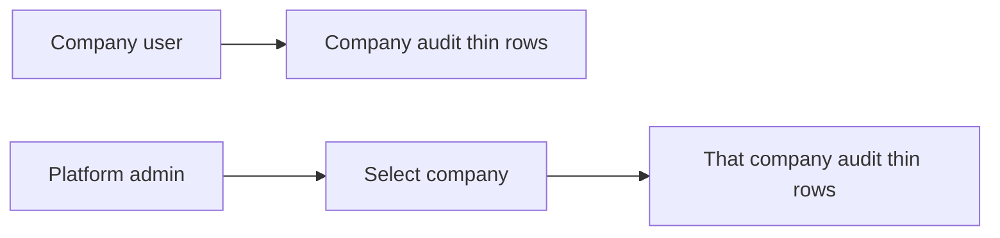

# Upcoming: audit list (thin rows, company-wise)

Delete this file when this is done. Index: [README.md](./README.md). Tenancy/auth: [PLATFORM_ADMIN.md](./PLATFORM_ADMIN.md).

The Audit screen **already exists** ([apps/web/app/audit/page.tsx](../../apps/web/app/audit/page.tsx), [apps/mobile/app/module/audit.tsx](../../apps/mobile/app/module/audit.tsx)). API already filters by `session.companyId`. This backlog is **layout + company-wise admin view**, not a new module.

**Web and mobile** — same behaviour.

## Locked rules

- **Thin rows**, not the current CRUD **cards**. One compact line per event (table on web; dense list row on mobile). No padded card stack.
- **Company-wise only.** A company session never sees another tenant’s audit. Do not add a mixed all-companies feed on the company app.
- **Platform admin** sees audit **per company** (pick a company, or a list grouped by company). Never one unlabelled dump of every tenant.
- All **company users** (admin and member) keep `/audit` for **their** company.

---

## Current problem

- Web uses `styles.card` (title + meta). Mobile uses `RecordRow`. Both read as **thick** blocks.
- UI does not show **actor**. `AuditLog` already has `companyId` and `actorId`.
- No platform-admin audit screen. When many companies exist, support needs **company-wise** history.

---

## Company app (`GET /audit`)

Keep `where: { companyId: session.companyId }`. Return actor name/email (join user), action, entityType, entity label/id, createdAt.

**Row (one line):** `time · actor · action · entityType · entity`

Tap/click expands before/after JSON (optional; default collapsed so rows stay thin).

Filters: search as today; optional entity type chip. Pagination stays.

Do **not** show a company column on this page (there is only one company).

---

## Platform admin (`GET /admin/audit`)

- Required **company** filter (query `companyId`) **or** grouped sections headed by company name.
- Same thin row layout as the company page, plus company name when grouped.
- Same APIs conceptually; platform JWT; 403 for company tokens.

---

## Files

| Area | Paths |
| --- | --- |
| Web company | `apps/web/app/audit/page.tsx` — compact table/rows, not `styles.card` |
| Mobile company | `apps/mobile/app/module/audit.tsx` — dense row, not finance `RecordRow` cards |
| API | `GET /audit` include actor; `GET /admin/audit?companyId=` |
| Web/mobile admin | `/admin/audit` company picker + thin list |

---

## Build checklist

- [ ] **A.1** Company web Audit: thin rows; still this company only
- [ ] **A.2** Company mobile Audit: same thin rows
- [ ] **A.3** Include actor on the row
- [ ] **A.4** Platform admin: audit **by company** (web + mobile), same thin layout
- [ ] **A.5** Tenancy test: company A cannot list company B audit; admin query without company scope does not leak a mixed unlabelled list

---

## Out of scope

- Immutable WORM storage, SIEM export
- Auditing platform-admin actions in the **company** Audit page (those belong in an admin audit log later if needed)
- Changing what gets written (writes stay as today)

---

## Done when

- Binhaj Audit on web and mobile is a **dense list**, not cards, and only Binhaj rows.
- Platform admin opens a **company**, sees that company’s audit in the same thin layout, and cannot mix tenants in one unlabelled list.
