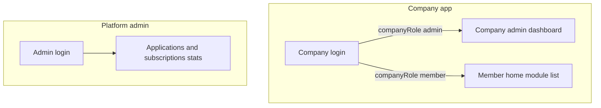

# Upcoming: role dashboards

Delete this file when this backlog is done. Index: [README.md](./README.md). Auth, team, subscriptions, Get started: [PLATFORM_ADMIN.md](./PLATFORM_ADMIN.md). Support: [SUPPORT.md](./SUPPORT.md). Finance reports stay in [FINANCE_REPORTS.md](./FINANCE_REPORTS.md) — dashboards are **summary cards + links**, not full reports.

**Every dashboard is web and mobile.** Same APIs. Cards tap through to the existing list/detail screens.

## Locked rules

- **Company admin dashboard** — only `companyRole=admin`. Members never see it.
- **Platform admin dashboard** — only `kind=platform` (application / Nuage admin). Company users never see it.
- Members keep the current **Home** (company name + module list + mobile sync). They do not get admin stats.
- Cards only. No charting library, no CSV, no PDF from these screens. Stripe metrics are later.

---

## 1. Company admin dashboard

**Who:** company admin only. **Where:** company app Home `/` on web and the Home screen on mobile (replace the Phase 0 placeholder for this role only).

**API:** `GET /company/dashboard` — `CompanyAdminGuard`. Members get **403**. Scoped to session `companyId`.

### Cards (tap → existing screen)

**Subscription**

- Plan name, status, trial end, expiry, days remaining
- Pending renewal banner if a request is waiting
- CTA: Renew / open `/subscription`

**Team**

- Active users / seat cap (and deactivated count)
- CTA: `/team`

**Work snapshot** (this company only; counts + one money figure, not full reports)

- Open quotations → `/quotations`
- Open jobs → `/jobs`
- Outstanding invoices (count) + AR total from existing accounts overview → `/invoices` / `/accounts`
- Overdue invoices count if status/due date already exists on invoices; otherwise omit until invoice reports land

**Inbox**

- Unread notification count → bell / notifications list
- **Open support** count → Support list ([SUPPORT.md](./SUPPORT.md))

**Shortcuts**

- Renew, Team, Support, Customers, Quotations, Jobs, Invoices

Not on this dashboard: other companies, Get started applications, platform-wide numbers, P&L tables, aging tables.

Members: unchanged Home (session + modules; mobile also keeps Sync now). Subscription dates stay at the **end of the menu**, with **Support** directly below — not as this dashboard.

---

## 2. Platform admin dashboard (application admin)

**Who:** platform admin only. **Where:** landing after admin login — web `/admin`, mobile Admin Home.

**API:** `GET /admin/overview` — `PlatformAdminGuard`. Expand the payload already listed in [PLATFORM_ADMIN.md](./PLATFORM_ADMIN.md).

This is the **stats home** for applications and subscriptions. Lists remain on their own routes; the dashboard is counts + short recent tables.

### Applications

- **Pending** (primary card) → `/admin/applications?status=pending`
- Approved this month / rejected this month
- Latest pending rows (name, contact email, submitted at) — tap opens the application

### Subscriptions

- Counts by status: trial, active, past_due, suspended, cancelled → `/admin/subscriptions` with that filter
- Expiring in 7 days and in 14 days (count + short list)
- **Pending renewal requests** (deposit inbox) → `/admin/renewal-requests`
- Optional: manual collections this month (count + AED) if payment rows exist

### Tenants (context, same page)

- Total companies, suspended companies
- Active users (platform-wide)
- Companies created this month (approved applications)

### Support

- **Open tickets** (platform-wide) → `/admin/support` ([SUPPORT.md](./SUPPORT.md))
- Optional: count grouped in the short recent table by company

Clicking a card opens the filtered list. No Stripe mix, no company job/invoice data on this screen.

---

## Current state

- Company Home is a Phase 0 placeholder: [apps/web/app/page.tsx](../../apps/web/app/page.tsx), [apps/mobile/app/index.tsx](../../apps/mobile/app/index.tsx).
- Money counts can reuse `GET /accounts/overview` internally for AR / open jobs; do not dump the full accounts page onto Home.
- Platform `/admin` overview does not exist yet; this plan **is** that page.

---

## Files likely to change

| Area | Paths |
| --- | --- |
| API | `GET /company/dashboard`; expand `GET /admin/overview` |
| Types | DTOs in `packages/types` |
| Web company | `apps/web/app/page.tsx` — role-aware Home |
| Web admin | `apps/web/app/admin/page.tsx` (or `/admin`) |
| Mobile company | `apps/mobile/app/index.tsx` — admin vs member |
| Mobile admin | Admin Home after Admin login |

Order: **API → web → mobile** for each dashboard.

---

## Build checklist

- [ ] **D.1** `GET /company/dashboard` (admin only); 403 for members
- [ ] **D.2** Company web Home = dashboard for admin; module Home for members
- [ ] **D.3** Company mobile Home same split; members keep sync controls
- [ ] **D.4** `GET /admin/overview` payload: applications + subscriptions + tenant counts + **open support**
- [ ] **D.5** Platform web `/admin` stats dashboard
- [ ] **D.6** Platform mobile Admin Home same stats
- [ ] **D.7** Cards navigate to filtered lists (applications, subscriptions, renewals, team, invoices, **support**)

---

## Out of scope

- Members seeing company-admin or platform stats
- Charts, CSV, PDF from dashboards
- Finance report tables (aging, P&L) — [FINANCE_REPORTS.md](./FINANCE_REPORTS.md)
- Stripe metrics
- Real-time / websocket updates (poll or load on open)

---

## Done when

- Binhaj **company admin** opens Home on web and mobile and sees subscription, seats, work counts, **open support**; can jump to Renew / Team / Support / invoices.
- Binhaj **member** Home has **no** those admin cards — only the module launcher (and mobile sync). Support still sits **below subscription** in the menu.
- Platform admin Home on web and mobile shows pending **applications**, subscription status mix, expiries, pending **renewals**, **open support**; cards open the right inbox.
