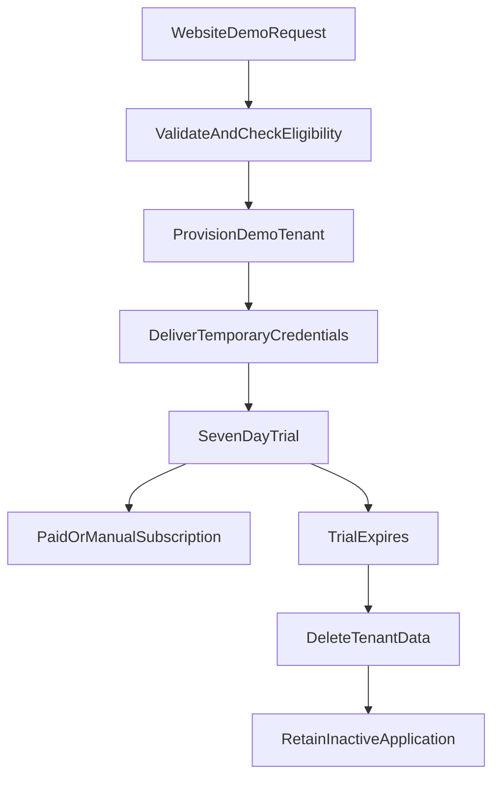

# Upcoming: Demo trial application and mobile support

**Scope:** automatically create a seven-day demo company from a public
website request, seed safe dummy data, email credentials through the
configured provider, enforce trial expiry, and support cancellation from the
web application and mobile app.

## Existing foundation

The API already contains:

- `CompanyApplication` for public applications.
- `POST /public/applications` in
  `apps/api/src/public/public.controller.ts`.
- An admin approval flow in
  `apps/api/src/admin/admin.service.ts` that creates a company, profile,
  owner, and `CompanySubscription`.
- Trial fields (`status`, `trialEndsAt`, and `expiresAt`) in
  `apps/api/prisma/schema.prisma`.
- Subscription access checks in
  `apps/api/src/auth/auth.service.ts`.
- A periodic expiry-notice worker in
  `apps/api/src/jobs/expiry-notices.service.ts`.

The current flow is manual approval, while the demo flow now provisions a
seven-day tenant automatically. The application sends the temporary
credentials after a successful transaction when the Resend configuration is
available; failed delivery remains available through the protected admin
handoff.

## Target lifecycle

## Data model and trial policy

- Add an explicit demo-trial identity to the data model, such as
  `CompanyApplication.kind/source`, `CompanyApplication.lifecycleStatus`,
  `CompanyApplication.provisionedAt`, and `CompanyApplication.cleanedAt`.
- Add a clear trial marker to `CompanySubscription` so cleanup can only target
  automatically provisioned demo tenants.
- Add a one-time password setup/reset state to `User`, or use a separate table
  containing a hashed token, expiry, used-at timestamp, and user/company
  relation. Never store a reset token or temporary password in plaintext.
- Create or select a dedicated `demo-trial` plan with exactly seven days.
  Do not rely on the current 14-day default.
- Normalize email addresses before eligibility checks.
- Enforce one demo trial per email across active users and prior demo
  applications. Keep the check transactional so concurrent submissions cannot
  create two trials.
- Keep the original application as an inactive registration after cleanup.
  Its status should make the lifecycle clear, for example
  `demo_expired` or `demo_cleaned`.

## Public API

Add a dedicated validated endpoint, preferably `POST /public/demo-requests`,
instead of silently changing the semantics of the existing manual application
endpoint.

Required input:

- Company name, mapped to `legalName` or a new `companyName` field.
- Email address.

Optional input may include contact name, phone, emirate, estimated users, and
notes. The endpoint must:

- Validate and trim all fields with the shared Zod validation approach.
- Apply a honeypot, rate limit, request-size limit, and a production-appropriate
  bot challenge or proof-of-email step.
- Never accept company ID, slug, plan ID, trial duration, role, password, or
  seed-data input from the website.
- Generate a collision-safe slug and internal random credentials/tokens.
- Return a safe, idempotent response without exposing user or company
  existence to arbitrary callers.
- Create the application, company, profile, subscription, owner, and demo data
  in one transaction.
- Queue or mark credential delivery only after the transaction commits.

The user-facing requirement says an existing email should produce an “already
exists” prompt. Returning that fact directly from a public endpoint allows
account enumeration. The safer behavior is to show the same generic success
message for every submission and email the existing account owner an
appropriate sign-in or password-reset link. If an explicit prompt is required,
require email verification before revealing eligibility.

## Demo data provisioning

Create a dedicated `DemoProvisioningService` rather than calling the seed
script or making many independent controller calls. It should:

- Create the company using the submitted company name so the application,
  profile, dashboard, quotations, invoices, and generated documents display
  that name automatically.
- Create one active company-admin owner.
- Create a seven-day `trial` subscription linked to the dedicated demo plan.
- Seed a small deterministic dataset: suppliers, products, customers,
  quotations, jobs, invoices, advances, and any required lookup/profile data.
- Use stable template values but new IDs and company-scoped relations.
- Avoid sample secrets, real customer information, real payment data, or files
  copied from another tenant.
- Be idempotent and transaction-safe so retries do not duplicate a tenant.
- Reuse/refactor the existing admin approval provisioning logic where the
  behavior is identical.

## Beta credentials and first login

OTP/email verification is deferred for the beta. Instead:

1. Generate a cryptographically random, complex temporary password during
   provisioning.
2. Store only its bcrypt hash and set `mustChangePassword = true`.
3. Send the web URL, mobile URL, email address, temporary password, and clear
   instructions that the password must be changed at first login.
4. Block normal application access until the user sets a new password.
5. Replace the temporary hash, clear `mustChangePassword`, and record the
   password-change timestamp.
6. Allow normal login from web and mobile afterward.

The temporary password must never be returned in the public website response,
written to logs, stored in Git, or displayed in browser analytics. It remains
only in process memory for the provider request. If email delivery is
misconfigured or rejected, the encrypted one-time admin handoff remains
available as a fallback.

Add endpoints for:

- Setting the first password after authenticated temporary login.
- Requesting a password reset for an existing account.
- Completing a password reset with a short-lived, hashed reset token once email
  configuration is available.
- Normal login after the first password change.

Apply the same password-reset rules to existing users who resubmit their email.

## Credential delivery

The API sends a provider-backed message after provisioning commits. It includes
the configured web-app and mobile-app links, username, temporary password,
trial end date, and first-login password-change instruction. The plaintext
password is never persisted. `credentialStatus` is set to `emailed` and the
encrypted handoff is removed only after the provider accepts the message.
If delivery fails, the status remains pending and the protected admin handoff
can be used for manual delivery. No OTP is required for the beta.

Required API configuration:

- `RESEND_API_KEY`
- `MAIL_FROM`
- `MAIL_REPLY_TO`
- `WEB_APP_URL`
- `MOBILE_APP_URL`
- `DEMO_CLEANUP_ENABLED=false` until a production dry-run is reviewed

## User cancellation

Only a company admin can cancel an active demo through
`POST /company/subscription/cancel-trial`. The API verifies that the
subscription is still a demo trial, deletes the company and cascaded tenant
data in a transaction, removes company uploads, revokes access through
cascaded sessions, and retains the `CompanyApplication` as
`demo_cancelled` with no company link. Converted or manually managed
subscriptions cannot use this endpoint.

## Expiry and cleanup

Extend the existing jobs module with a dedicated demo cleanup worker:

- Find only demo subscriptions whose status is `trial` and whose
  `expiresAt` is in the past.
- Re-check that the subscription was not converted to `active`, extended, or
  manually protected by an admin.
- Mark the application/tenant as expired before deletion for observability.
- Delete the company in a transaction, relying on verified cascade relations
  to remove tenant data, and handle uploaded files separately.
- Remove nested uploads and legacy files associated with the tenant using the
  upload-storage compatibility rules.
- Keep the application record with inactive status, submitted company name,
  normalized email, timestamps, and cleanup result.
- Make retries safe and log failures without deleting a different tenant.
- Add a protected dry-run/admin report before enabling production deletion.

Cleanup must never delete a company with an active paid/manual subscription or
an admin-approved extension.

## Web application changes

The application web client must support:

- First-time activation/password setup.
- Session response state indicating whether password setup is required.
- A clear seven-day trial status and expiry date.
- Renewal/subscription navigation before expiry.
- Expired-trial handling that clears credentials and routes to the correct
  login/help surface.
- Safe handling of API 401/403 responses.

Relevant areas include:

- `apps/web/app/login/page.tsx`
- `apps/web/app/get-started/page.tsx` if the app-side form remains
  backwards-compatible
- `apps/web/lib/api.ts`
- `apps/web/lib/auth.ts`
- A new activation/reset route and shared password form

## Mobile application changes

The mobile app does not need to host the public marketing form. It must consume
the same account lifecycle:

- Add activation/password-reset screens or a safe handoff to the web
  activation link.
- Add a deep-link scheme only if the activation experience is intended to
  finish inside the app.
- Route users with `mustChangePassword` to setup before the home screen.
- Display the submitted company name from the authenticated session; never use
  a hard-coded company name.
- Display trial status/expiry where subscription information is shown.
- Clear secure credentials and return to login when the API reports expired
  trial or invalid session.
- Prevent offline sync from sending mutations for an expired or unactivated
  account.

Relevant areas include:

- `apps/mobile/app/login.tsx`
- `apps/mobile/app/admin-login.tsx`
- `apps/mobile/app/_layout.tsx`
- `apps/mobile/lib/auth.ts`
- `apps/mobile/lib/api.ts`
- `apps/mobile/lib/offline/syncEngine.ts`
- A new activation/password-reset screen if native activation is selected

## Verification and rollout

- Unit-test validation, email normalization, one-trial eligibility, slug
  collisions, idempotent retries, and transaction rollback.
- Test that demo data belongs only to the newly created company.
- Test temporary-password login, mandatory first password change, reuse of the
  temporary password after the change, password reset, normal login, and
  mobile handoff.
- Test exactly seven-day expiry and that converted/extended companies are
  protected from cleanup.
- Run cleanup in dry-run mode against a copy of production data.
- Verify restored uploads and database backups before enabling deletion.
- Release the API/mobile changes first, verify the controlled credential
  delivery process and cleanup controls, then activate the website form.
