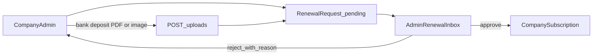

# Upcoming: platform admin, company login, subscriptions

Delete this file when this backlog is done. Index: [README.md](./README.md). Finance: [FINANCE_REPORTS.md](./FINANCE_REPORTS.md). Invoices: [INVOICE_REPORTS.md](./INVOICE_REPORTS.md). Role dashboards: [DASHBOARDS.md](./DASHBOARDS.md). Support: [SUPPORT.md](./SUPPORT.md). Audit list: [AUDIT.md](./AUDIT.md).

Develop **one slice at a time**. **Every feature is web and mobile** (company app and platform admin). Same APIs; layout may differ. Public Get started stays on the marketing site.

## Locked rules

- Two logins, two JWTs: `kind=platform` vs `kind=company`.
- Platform admins live in `PlatformAdmin`, **not** in `User`.
- **Three people:**
  1. **Platform admin** — Nuage: companies, create users, subscriptions, suspend company, send notices to companies.
  2. **Company admin** — `companyRole=admin`. Team (active/deactive only). Subscription page: dates **and** submit **renewal request** (amount, reference, bank deposit file). Cannot create users, reset passwords, or change the plan themselves.
  3. **Company member** — full marble app + notification bell + **subscription dates at the end of the mobile menu** (read-only) + **Support** under that. No user management.
- **Create user** = platform admin only. **Active / deactive** = platform admin **or** company admin (same company). **Suspend whole company** = platform admin only.
- Notifications module: in-company notices, platform → company, subscription + near-expiry to **company admins** (main accounts). Web + mobile bell. Email later optional.
- Subscriptions: **manual only** for now. Company admin can **submit a renew request** with a **bank deposit slip** (upload). Platform admin approves/rejects and then extends the subscription. **Stripe is later — do not build it in this backlog.**
- **Parity:** no module is web-only or mobile-only. Platform admin uses `/admin` on web and an **Admin** stack on mobile (separate login). Company users never see platform admin screens.
- **Support:** button **below subscription** for every company user. Submit = anyone. Company admin sees/closes that company’s tickets. Platform admin sees all company-wise and can close any. Details: [SUPPORT.md](./SUPPORT.md).

## Current state (do not break)

- Company JWT login: `POST /auth/login` — email + password, optional `companySlug`.
- Guard: `BootstrapAuthGuard` + `x-marble-token` on all business APIs.
- Seed: Binhaj Marble, `owner@binhajmarble.ae`.
- Session today: `{ companyId, userId, email, companyName }` — must grow a `kind` field.
- Files: `apps/api/src/auth/*`, `apps/web/app/login`, `apps/mobile/app/login.tsx`, `apps/api/prisma/schema.prisma` (`Company`, `User`).

---

## Target architecture

```
Company web /login ──► POST /auth/login        ──► JWT kind=company ──► existing modules
Company mobile login ──► same
Admin web /admin/login ──► POST /auth/admin/login ──► JWT kind=platform ──► /admin only

CompanyAuthGuard     → customers, jobs, invoices, sync, …
CompanyAdminGuard    → team, subscription renew, company dashboard, send internal notice, close company support
PlatformAdminGuard   → /admin/* including overview dashboard, renewal inbox, all-company support
Public form          → POST /public/applications
```

Cross-use is **403** (admin token cannot post invoices; company token cannot list all companies).

---

## Data model

### `PlatformAdmin`

- email (unique), name, passwordHash, active, timestamps

### `User` (many accounts per company)

- name, email, passwordHash, **active**
- `companyRole`: `admin` | `member` — **not** a full permission matrix. Members still use quotations/jobs/invoices. Only `admin` can activate/deactivate users and send internal notices. **Everyone** can see subscription **dates** (plan name, status, trial end, expiry) — members see this at the **bottom of the mobile menu**.
- `accessExpiresAt` (nullable) — optional per-user end date set by **platform admin**. Used for “user near expiry” notices.
- Same email may exist on another company; login optional `companySlug`

**Who does what**

| Action | Platform admin | Company admin | Member |
| --- | --- | --- | --- |
| Create company / approve Get started | yes | no | no |
| Create user / reset password / set role | yes | no | no |
| Suspend whole company | yes | no | no |
| Company admin Home dashboard (subscription, seats, work counts) | no | **yes** | no (module Home only) |
| Platform Home dashboard (applications + subscriptions stats) | **yes** | no | no |
| See plan name + trial/expiry dates | yes | **yes** (full status page + dashboard) | **yes** (mobile menu footer, read-only) |
| Change plan / record payment as collected | yes | no (can **request** renew with deposit slip) | no |
| Activate / deactivate a user in **this** company | yes | **yes** | no |
| Send notice to a company | yes | internal only | no |
| Marble app (quotes, jobs, invoices, **audit for this company**) | no | yes | yes |
| Platform audit **by company** | **yes** | no | no |
| Submit support request | no | **yes** | **yes** |
| See / close company support tickets | **all companies** (close any) | **this company** (close) | own tickets only (cannot close) |

Login: company subscription open **and** `user.active` **and** (`accessExpiresAt` null or future).

Binhaj: platform admin creates `owner@…` as `companyRole=admin` (main account) plus `sales@…` as `member`. Company admin can deactivate sales; cannot create a new email.

### `Plan` (catalog)

- name, code (unique: `pilot`, `standard`, …)
- interval: `monthly` | `yearly`
- priceAed
- trialDays
- maxUsers (0 = unlimited)
- active
- Do **not** add `stripePriceId` until Stripe is scheduled

Assigning a plan **copies** price and seat cap onto the subscription so later catalog edits do not rewrite history.

### `CompanySubscription` (one per company)

- companyId (unique), planId
- status: `trial` | `active` | `past_due` | `suspended` | `cancelled`
- billingChannel: `manual` only (no `stripe` value in this slice)
- startsAt, trialEndsAt, expiresAt
- seatsIncluded, seatsOverride (nullable)
- note
- Last manual payment fields (set when platform admin records a collection **or** approves a renewal)
- **Do not** add Stripe customer/subscription ids until Stripe is scheduled

### `SubscriptionRenewalRequest`

Company admin submits; platform admin decides. Reuse existing `POST /uploads` (image/PDF of bank deposit). Store under `companies/{companyId}/subscription-proofs/`.

- companyId, submittedByUserId
- amount, paidAt (deposit date), bankReference, notes
- depositDocumentUrl (required)
- status: `pending` | `approved` | `rejected`
- rejectReason, decidedAt, decidedByAdminId
- **At most one `pending` per company**

**Approve:** set subscription `active`, extend `expiresAt` by plan interval (or admin-entered date), copy amount/reference onto last manual payment, notify company admins.  
**Reject:** reason required; notify company admins; they may submit again.



### Access gate (company login + company APIs)

Login and company APIs allowed only when **both** are true:

1. **Company-wise:** subscription is `trial` / `active` / `past_due` (v1), not `suspended` / `cancelled`, and `expiresAt` is null or in the future.
2. **User-wise:** `User.active === true` **and** (`accessExpiresAt` is null or in the future).

Messages:

- Company blocked → `Subscription inactive. Contact support.`
- User deactivated → `This login is disabled. Contact your company admin.`
- User expired → `This login has expired. Contact your company admin.`

**Seats:** creating an **active** user (platform admin only) fails if over cap. Deactivated users do not count. Company admin deactivating someone frees a seat.

### `CompanyApplication` (Get started form)

Public website posts here. **Not** a `Company` until approved.

- status: `pending` | `approved` | `rejected`
- rejectReason (set on reject)
- decidedAt, decidedByAdminId
- companyId (set on approve, link to the created tenant)
- source: `website` (later: `referral`, …)
- timestamps + optional honeypot / IP for spam

Field mapping from the form is in **Get started form** below.

### `Notification` + `NotificationReceipt`

In-app inbox (web + mobile). Email is a later optional channel, not required to ship.

**Notification**

- `companyId` (null only for platform-admin drafts; delivery is always to a company or its users)
- `source`: `platform` | `company` | `system`
- `kind`: `admin_to_company` | `company_internal` | `subscription` | `expiry_subscription` | `expiry_user` | `support`
- `title`, `body`
- `audience`: `company_admins` | `all_users` | `one_user`
- `userId` (when `one_user`)
- `createdByPlatformAdminId` / `createdByUserId` (nullable)
- `createdAt`

**NotificationReceipt**

- notificationId, userId, readAt (nullable)
- unique (notificationId, userId)

**Who receives what**

| Kind | Who gets it |
| --- | --- |
| Platform → company | All `companyRole=admin` of the chosen company (or all companies if broadcast). Optional: all users if platform ticks “everyone”. |
| Inside the company | Company admin writes a notice → `all_users` in that company (or one user). Members cannot send. |
| Subscription | **Company admins only** (main accounts): trial started, renewal approved/rejected, payment recorded, past_due, suspended, plan changed. Fired by platform actions (no Stripe yet). |
| Subscription near expiry | Company admins: 14 / 7 / 3 / 1 days before `expiresAt` or `trialEndsAt`. Daily job; do not spam the same day twice (store `lastExpiryNoticeAt` on subscription or a notice key). |
| User near expiry | That user **and** company admins, when `accessExpiresAt` is within 7 / 3 / 1 days. Platform admin sets `accessExpiresAt`. |
| Support | New ticket → **company admins**. Closed → the **submitter**. Full module: [SUPPORT.md](./SUPPORT.md). |

### `SupportRequest`

See [SUPPORT.md](./SUPPORT.md). Any company user creates; company admin closes this company; platform admin closes any. Menu: **below subscription**.

Bell on web + mobile; unread count on session. List + mark read. Platform admin has **Notifications** to compose (pick companies, title, body) and a log of system notices.

---

## Env

| Variable | Purpose |
| --- | --- |
| `PLATFORM_ADMIN_EMAIL` / `PLATFORM_ADMIN_PASSWORD` | Seeded platform admin (not a password in git) |

Stripe env vars: **not used until a later Stripe slice.**

Existing: `JWT_SECRET`, `BOOTSTRAP_TOKEN`, `BOOTSTRAP_COMPANY_SLUG`.

---

## API

### Auth

- `POST /auth/login` — company only; fail if gated
- `POST /auth/admin/login` — platform only
- `GET /auth/session` — company
- `GET /admin/session` — platform
- `POST /auth/logout` — both (client clears token)

### Admin

- `GET/POST /admin/companies` · `GET/PATCH /admin/companies/:id`
- `GET/POST /admin/companies/:id/users` · `PATCH /admin/users/:id` — create, deactivate, reactivate, reset password
- `POST /admin/companies/:id/suspend` · `POST /admin/companies/:id/unsuspend` — company-wise access
- `GET/POST /admin/plans` · `PATCH /admin/plans/:id`
- `GET/PATCH /admin/companies/:id/subscription`
- `POST /admin/companies/:id/subscription/manual-payment` — admin records a collection without a company request
- `GET /admin/renewal-requests` · `GET /admin/renewal-requests/:id`
- `POST /admin/renewal-requests/:id/approve` · `POST /admin/renewal-requests/:id/reject`
- `POST /admin/applications/:id/approve` — creates Company + first **company admin** User + trial subscription
- `POST /admin/applications/:id/reject` — `{ reason }`
- `GET /admin/overview` — **platform dashboard**: application counts (pending, approved/rejected this month), subscription counts by status, expiries 7/14 days, pending renewals, companies, suspended, active users. See [DASHBOARDS.md](./DASHBOARDS.md).
- `POST /public/applications` — Get started form (no auth; rate-limit; captcha later if abused)
- `GET /admin/applications` · `GET /admin/applications/:id`
- `POST /admin/notifications` — send to one/all companies (admins or all users)
- `GET /admin/notifications` — sent log

### Company (session `kind=company`)

- `GET /company/dashboard` — **company admin only** — Home stats (subscription snapshot, seats, work counts, unread). Members 403. See [DASHBOARDS.md](./DASHBOARDS.md).
- `GET /company/subscription` — **every company user** — plan name, status, dates (no admin notes)
- `POST /company/subscription/renewal-requests` — **company admin only** — multipart or JSON + `depositDocumentUrl` after `POST /uploads`; amount, paidAt, bankReference, notes; deposit file **required**
- `GET /company/subscription/renewal-requests` — **company admin** — own company history + pending
- `GET /company/users` — **company admin only** — list colleagues
- `PATCH /company/users/:id` — **company admin only** — `{ active: true | false }` only; 403 if target is themselves last admin or creating fields
- `GET /notifications` · `POST /notifications/:id/read` · unread count on session
- `POST /notifications` — **company admin only** — internal notice `{ title, body, audience: all_users \| userId }`
- Support: [SUPPORT.md](./SUPPORT.md) — `POST/GET /support/requests`, `POST /support/requests/:id/close` (company admin)

- **Platform support**

- `GET /admin/support/requests` · `POST /admin/support/requests/:id/close`
- `GET /admin/audit?companyId=` — that company’s audit, thin list ([AUDIT.md](./AUDIT.md))

### Stripe

**Later — not in this backlog.** No checkout, portal, or webhooks until you schedule that work.

---

## Web surfaces

### Company (web + mobile)

- `/login` — subscription / deactivated / expired-user errors
- **Home `/`:** **company admin** sees the management dashboard ([DASHBOARDS.md](./DASHBOARDS.md)). **Members** keep the module launcher (no admin cards).
- Existing marble modules for **all** active members and company admins. **Audit:** thin rows, **this company only** ([AUDIT.md](./AUDIT.md)).
- **Notifications** (bell) — everyone
- **Mobile menu (all company users):** at the **end** of the drawer/tab list: **Subscription** block (plan, status, dates), then **Support** under it ([SUPPORT.md](./SUPPORT.md)). Tapping subscription opens a read-only sheet. Tapping Support opens compose / list. No pay button.
- **Web nav footer (same):** subscription summary, then Support.
- **Company admin only:** `/team` (active/deactive). `/subscription`: dates, seats, **Renew**: amount, deposit date, bank reference, notes, **attach bank deposit** (PDF/JPG/PNG). Show pending/rejected status. No plan change, no Stripe.
- **No** `/admin` (that is platform)

### Platform admin (web **and** mobile)

- Web: `/admin/login` then `/admin/*`
- Mobile: Admin login (not the company login form) then the same companies, users, applications, plans, subscriptions, notifications
- Same APIs. No feature that exists on admin web but not admin mobile.

- `/admin/login`, `/admin` **stats dashboard** (applications + subscriptions — [DASHBOARDS.md](./DASHBOARDS.md))
- `/admin/companies` — create; **users** (create, role admin/member, accessExpiresAt, reset password, active); suspend company; subscription panel
- `/admin/applications` — approve / reject
- `/admin/subscriptions` — all companies
- `/admin/renewal-requests` — inbox: pending deposits to approve/reject (open file, then extend expiry)
- `/admin/notifications` — compose to companies; history
- `/admin/support` — all companies’ tickets, grouped by company; close any ([SUPPORT.md](./SUPPORT.md))
- `/admin/audit` — **company-wise** audit (pick company); thin rows ([AUDIT.md](./AUDIT.md))

---

## Get started form (website → admin approve / reject)

Keep the public form **short**. Extra company profile (logo, bank, TRN polish) is filled **after** they are in the app.

**Do not collect:** password, card, bank IBAN, full legal address (optional later), trade licence upload in v1.

### Fields to collect

**Required (cannot submit without these)**

| Field | Why admin needs it |
| --- | --- |
| Company legal name | Becomes `Company.name` / profile `legalName` |
| Contact full name | First user `name` |
| Work email | First login email; unique check vs existing users + pending apps |
| Mobile phone | WhatsApp / call to verify they are real |
| Emirate / city | UAE context; later reporting |

**Optional (help approve vs reject; do not block submit)**

| Field | Why |
| --- | --- |
| Trade name | Signboards vs legal name |
| TRN | UAE tax invoices; empty is ok for tiny shops |
| Approx. users | Suggests plan seats (`1–2` / `3–10` / `11+`) |
| Plan interest | `trial / pilot` vs `standard` — admin can still pick another plan on approve |
| What they need | Checkboxes: quotations, jobs, invoices, mobile — not a commitment |
| How they heard | `google` / `instagram` / `referral` / `other` |
| Note | Free text, max ~500 chars |

Honeypot or `website` hidden field for bots (not shown to admin unless filled).

### What admin sees on an application

- All form fields above
- Submitted at
- Duplicate warnings (same email or similar company name)
- Actions: **Approve** (choose plan, trial days, generate slug, set owner password or send set-password link) / **Reject** (required short reason)

**Approve creates:** `Company` + profile + first user `companyRole=admin` (main account) + trial. Extra **members** are created later by **platform admin**. Company admin only toggles active.

**Reject:** status `rejected`, reason stored, no company created. Same email may apply again later (or block 30 days — v1: allow, show previous reject).

Public form lives on the **marketing site** (or a simple `/get-started` page). It only calls `POST /public/applications`. It is **not** instant signup.

Subscription panel on a company:

1. Plan, channel, status, dates, seats, note
2. **Manual (admin):** record payment without a request; extend `expiresAt`
3. **Company renew request:** admin opens deposit slip → approve (extend) or reject

Do **not** add Stripe buttons in this slice.

---

## Mobile

**Company app (members + company admin)**

- Same modules as web: catalog, CRM, quotations, jobs, invoices, advances, accounts, **reports**, notifications
- Bell; subscription dates at **end of menu**; **Support below subscription**; company admin Team + **Renew subscription** (deposit upload)
- **Home:** company admin dashboard vs member module list ([DASHBOARDS.md](./DASHBOARDS.md))

**Platform admin app**

- Separate Admin login (not company `/login`)
- **Home:** applications + subscriptions stats dashboard
- Same modules as web admin: companies, users, applications, plans, subscriptions, send notifications, **support by company**, **audit by company**

Layout can differ; **no feature missing on one side**.

---

## Seed

- Plans: `pilot` (0 AED, unlimited or high seats, manual-friendly), `standard` (placeholder AED price)
- Binhaj: `pilot`, `billingChannel=manual`, `status=active`, no expiry (or far future)
- `owner@binhajmarble.ae` as `companyRole=admin`; optional second `member` to prove multi-login and company-admin deactive
- One `PlatformAdmin` from env

---

## Files likely to change

| Area | Paths |
| --- | --- |
| Schema / seed | `apps/api/prisma/schema.prisma`, `apps/api/prisma/seed.ts` |
| Auth | `apps/api/src/auth/*` — split guards, JWT payload `kind` |
| Admin API | new `apps/api/src/admin/` |
| Uploads | existing `POST /uploads` — also subscription deposit proofs |
| Types | `packages/types` — session, admin DTOs, plan enums |
| Web company | login, **role-aware Home**, Notifications, Team, **`/subscription` renew + deposit**, dates + **Support** in nav footer |
| Web admin | `apps/web/app/admin/**` including stats Home |
| Mobile company | login, **admin vs member Home**, bell, dates + **Support** at end of menu, Team, marble modules |
| Mobile platform admin | Admin login + **stats Home** + same admin modules as web |

Order per slice: **Prisma/domain + API → web → mobile** (never leave a slice on one client).

---

## Build checklist (tick when done)

### Wave 0 — foundation

- [ ] **0.1** Prisma: `PlatformAdmin`, `Plan`, `CompanySubscription` + migration
- [ ] **0.2** Seed plans, Binhaj subscription, platform admin from env
- [ ] **0.3** JWT `kind`; `CompanyAuthGuard` vs `PlatformAdminGuard`
- [ ] **0.4** `POST /auth/admin/login` + `GET /admin/session`
- [ ] **0.5** Company login + company APIs enforce subscription gate
- [ ] **0.6** Web `/admin/login` + `/admin` shell **and** mobile Admin login + shell
- [ ] **0.7** Company web/mobile still log in as today when subscription is active

### Wave 1 — companies and users

- [ ] **1.1** Admin: list/create/edit companies (name, slug)
- [ ] **1.2** Admin: list/add/deactivate/reactivate **many** users per company; reset password; company suspend/unsuspend
- [ ] **1.3** Seat cap on admin user-create; deactivated users do not count
- [ ] **1.4** Overview counts (including deactivated users vs suspended companies)
- [ ] **1.5** `CompanyApplication` + public Get started API
- [ ] **1.6** Admin inbox: approve (first user = **company admin**) / reject
- [ ] **1.7** Company admin: list users + **active/deactive only** (web + mobile). Cannot create or reset password.
- [ ] **1.8** `GET /company/subscription` for **all** company users (plan, status, trial/expiry dates only)
- [ ] **1.9** **Mobile menu footer:** every user sees those dates at the **end** of the menu; web nav footer matches

### Wave 2 — subscriptions (manual)

- [ ] **2.1** Plans CRUD
- [ ] **2.2** Assign plan / channel / status / dates / note on company
- [ ] **2.3** Admin can still record a manual payment and extend expiry
- [ ] **2.4** Subscriptions list (all companies)
- [ ] **2.5** Lockout copy on web + mobile login when gated
- [ ] **2.6** Status changes notify company admins
- [ ] **2.7** Company admin: renew form + **required bank deposit upload** (web + mobile)
- [ ] **2.8** Admin inbox: approve (extend subscription) / reject with reason; notify company admin
- [ ] **2.9** One pending renewal per company; members cannot submit

### Wave 3 — Stripe (not this backlog)

Do not implement. Separate go-ahead later: checkout, customer portal, webhooks, `stripePriceId`, Stripe customer/subscription ids.

### Wave 4 — notifications

- [ ] **4.1** `Notification` + `NotificationReceipt`; GET inbox + mark read; unread on session
- [ ] **4.2** Platform admin compose: one company / all companies; audience company_admins or all_users
- [ ] **4.3** Company admin compose: internal notice to all users (or one user)
- [ ] **4.4** System: subscription events → company admins (main accounts)
- [ ] **4.5** Daily job: subscription near expiry (14/7/3/1 days) → company admins
- [ ] **4.6** Daily job: user `accessExpiresAt` near (7/3/1 days) → that user + company admins
- [ ] **4.7** Bell UI web + mobile

### Wave 5 — dashboards

See [DASHBOARDS.md](./DASHBOARDS.md). Do after Waves 1–2 so the counts have data.

- [ ] **5.1** Company admin Home dashboard (web + mobile); members keep module Home
- [ ] **5.2** Platform admin Home: applications + subscriptions stats (web + mobile)

### Wave 6 — support

See [SUPPORT.md](./SUPPORT.md). Button below subscription.

- [ ] **6.1** Any company user submits; member sees own; company admin sees/closes company tickets
- [ ] **6.2** Platform admin: all companies, grouped; close any (web + mobile)

### Wave 7 — audit list

See [AUDIT.md](./AUDIT.md). Can ship in parallel with later waves; does not wait on Stripe.

- [ ] **7.1** Company Audit: **thin rows**, this company only (web + mobile)
- [ ] **7.2** Platform admin: audit **by company**, same thin rows (web + mobile)

---

## Out of scope (do not build unless asked)

- Full in-company **roles** (sales vs accounts). Only `admin` vs `member`.
- Company admin **creating** users or resetting passwords (platform admin only)
- Company member paying or changing the plan (dates only). **Renew + deposit is company admin only.**
- **Stripe** (checkout, portal, webhooks) — later, not this backlog
- Email/SMS/WhatsApp delivery (in-app first)
- Impersonate a company
- Instant self-serve login (no admin) or Checkout on the Get started form
- Trade-licence / ID file uploads in v1 (add later if you need KYC)
- Stripe Connect, usage-based billing, tax IDs
- Chart of accounts — see [FINANCE_REPORTS.md](./FINANCE_REPORTS.md)

---

## Done when

- You log in as platform admin on **web and mobile** and manage Binhaj without using job/invoice screens.
- Binhaj staff log in on web and mobile exactly as today while `active`.
- Suspending Binhaj blocks company login on web and mobile; unsuspend restores it.
- Manual renewals: company admin uploads a bank deposit; platform admin approves and the dates extend. No Stripe required.
- Website Get started → approve creates the **company admin** (main account); platform admin adds extra members; company admin can only active/deactive them.
- Every company user sees plan + trial/expiry dates at the **end of the mobile menu** (and web nav footer), with **Support** directly below.
- Company admin Home is a **dashboard**; member Home is not. Platform admin lands on **application + subscription stats**.
- Audit is **thin rows** and **company-wise** ([AUDIT.md](./AUDIT.md)).
