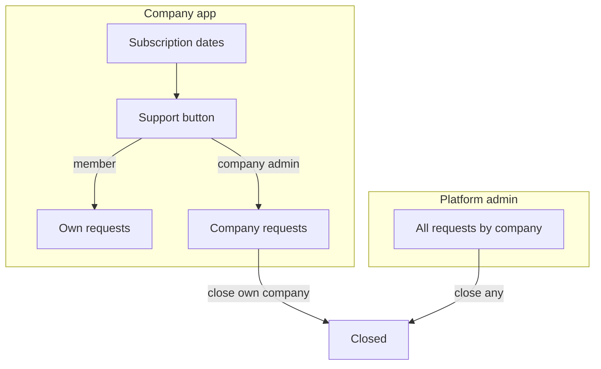

# Upcoming: in-app support requests

Delete this file when this backlog is done. Index: [README.md](./README.md). Auth and roles: [PLATFORM_ADMIN.md](./PLATFORM_ADMIN.md). Dashboards: [DASHBOARDS.md](./DASHBOARDS.md).

**Web and mobile.** Same APIs. Not email, not a public contact form.

## Locked rules

- **Support button** sits **directly below the subscription block** (mobile menu end, web nav footer). Every **company user** (admin and member) sees it.
- **Any company user** can **submit** a request (title + body; optional screenshot).
- **Members** see **their own** requests only (open + closed).
- **Company admin** sees **all requests for their company** and can **close** any of those.
- **Platform admin** (application admin) sees **all companies**, grouped by company, and can **close any** request.
- Company users never see another company’s tickets. Platform admin does not use the company Support button (they use `/admin/support`).
- Close is the only resolution in v1 (no reopen — submit a new request). Optional short close note.
- Stripe, email, chat widgets: not this backlog.

---

## Data: `SupportRequest`

- companyId, createdByUserId
- title, body (required)
- attachmentUrl (nullable) — image via existing `POST /uploads` (`companies/{companyId}/support/`)
- status: `open` | `closed`
- closedAt, closedByKind (`company_admin` | `platform_admin`), closedByUserId / closedByAdminId, closeNote (nullable)
- createdAt, updatedAt

Index: open tickets per company (dashboard counts). No public (unauthenticated) create.

---

## Who does what

| Action | Member | Company admin | Platform admin |
| --- | --- | --- | --- |
| Submit | yes (own company) | yes | no (use admin app only if you add later) |
| List own | yes | yes | — |
| List whole company | no | **yes** | all companies, grouped |
| Close | no | **yes** (this company) | **yes** (any) |
| Reopen | no | no | no |

---

## API

**Company (`kind=company`)**

- `POST /support/requests` — any company user — `{ title, body, attachmentUrl? }`
- `GET /support/requests` — member: own rows; company admin: all for `session.companyId`. Query `status=open|closed|all` (default open).
- `GET /support/requests/:id` — 404 if not allowed (member: not theirs; always scoped to company)
- `POST /support/requests/:id/close` — **company admin only** — optional `{ note }`. 403 for members.

**Platform (`kind=platform`)**

- `GET /admin/support/requests` — all companies; filters: `companyId`, `status`. Grouped in the UI by company.
- `GET /admin/support/requests/:id`
- `POST /admin/support/requests/:id/close` — any ticket — optional `{ note }`

Notify (when notifications exist): new request → that company’s admins; close → the submitter. Platform admin sees the inbox on their Support screen; optional unread on admin overview.

---

## Surfaces

**Company (web + mobile)** — all users, **below subscription**:

- Button **Support**
- Compose: title, details, optional image
- Member: my tickets (open first)
- Company admin: company tickets; **Close** on open ones

**Platform (web + mobile)**

- `/admin/support` — list grouped by company (open count per company); open a ticket; **Close**
- Overview card: open support count → this list

Not a marble module in `MODULE_NAV` (Customers, Jobs, …). It lives in the footer with subscription, not in the main module list.

---

## Files likely to change

| Area | Paths |
| --- | --- |
| Schema | `SupportRequest` in `apps/api/prisma/schema.prisma` |
| API | new `apps/api/src/support/` + admin support routes |
| Web company | footer under subscription; `/support` list + compose |
| Web admin | `apps/web/app/admin/support` |
| Mobile company | menu under subscription dates |
| Mobile admin | Admin Support screen |

Order: **Prisma + API → web → mobile**. Build after login/roles (PLATFORM_ADMIN Wave 0–1). Notifications can land before or after; if after, skip notify until Wave 4.

---

## Build checklist

- [ ] **S.1** Prisma `SupportRequest` + migration
- [ ] **S.2** Company APIs: create, list (own vs company), close (admin only)
- [ ] **S.3** Platform APIs: list all (filter by company), close any
- [ ] **S.4** Company web + mobile: Support **below subscription**; submit; member=own list; admin=company list + close
- [ ] **S.5** Platform web + mobile: `/admin/support` by company + close
- [ ] **S.6** Dashboard cards: company admin open count; platform open count ([DASHBOARDS.md](./DASHBOARDS.md))
- [ ] **S.7** Notify company admins on create, submitter on close (after notifications)

---

## Out of scope

- Email/SMS/WhatsApp
- Live chat, SLA timers, assignments, priorities, categories
- Members closing tickets (even their own)
- Public / logged-out support form
- Reopen; comments thread (v1 is one message + close). Add replies later if needed.

---

## Done when

- Any Binhaj user can tap **Support** under subscription on web and mobile and submit.
- Sales (member) sees only their tickets. Owner (company admin) sees all Binhaj tickets and can close them.
- Platform admin sees Binhaj and other companies separately and can close any ticket.
- A member cannot close; a company admin cannot see another company’s tickets.
